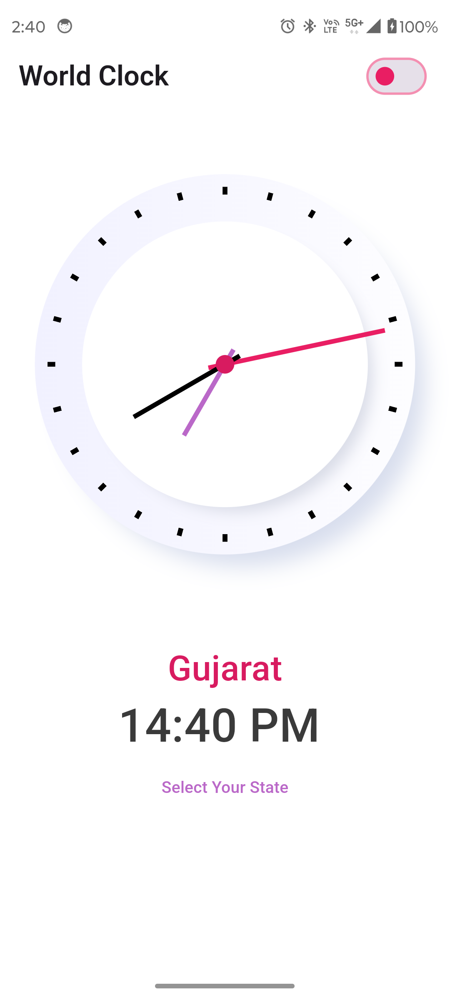
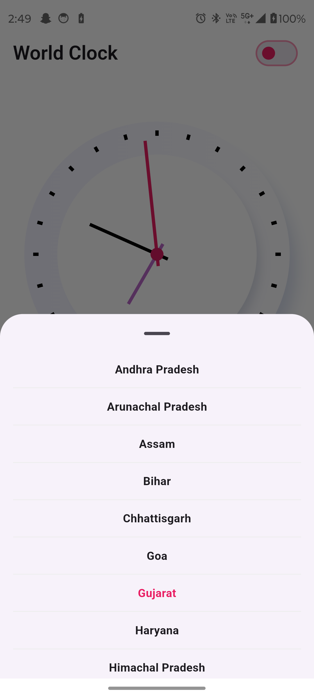
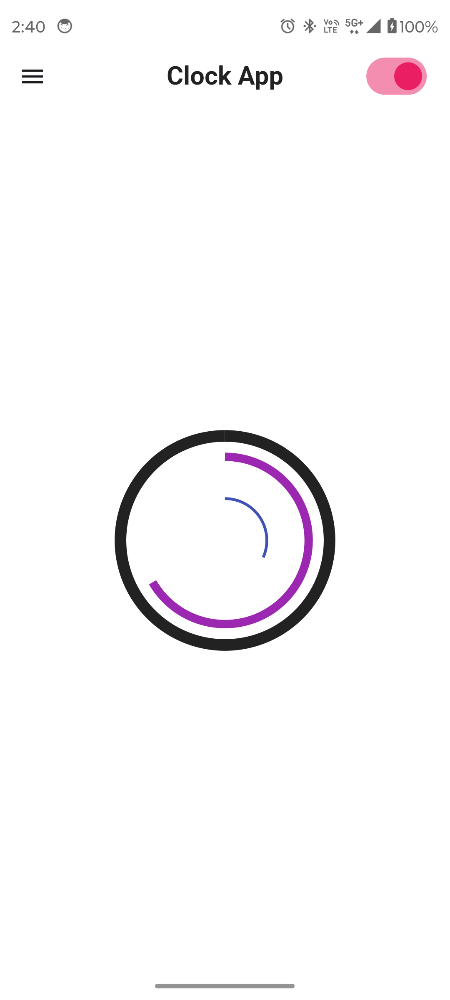
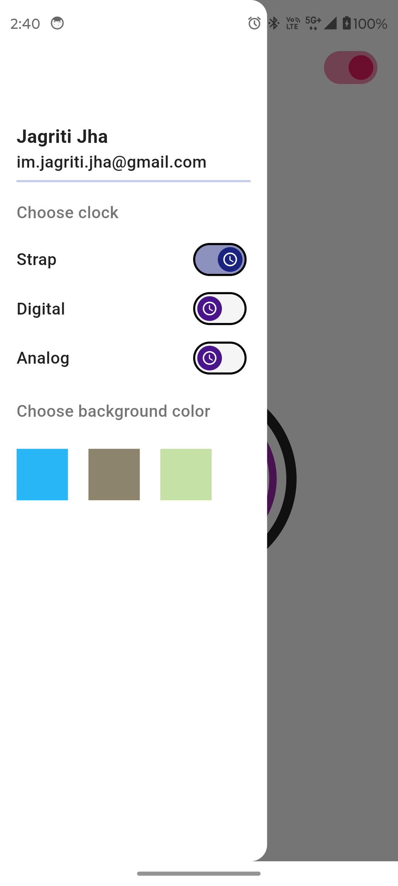
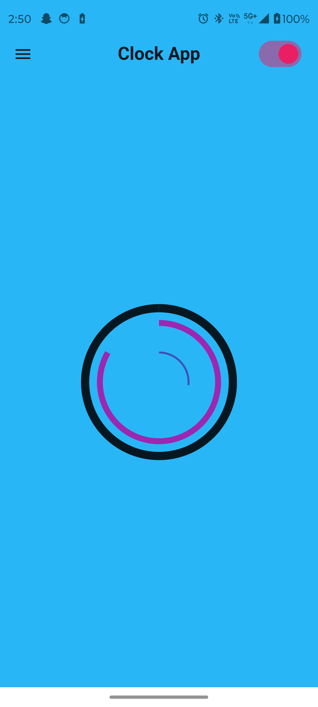
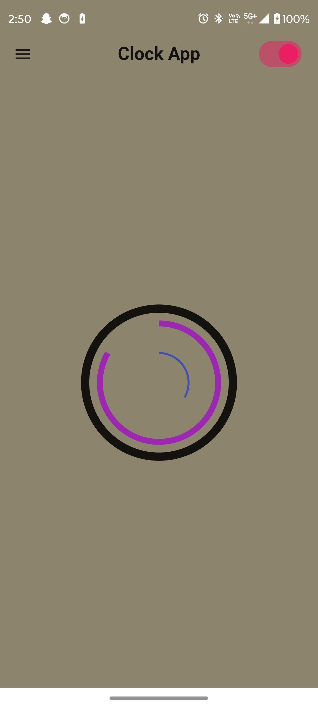
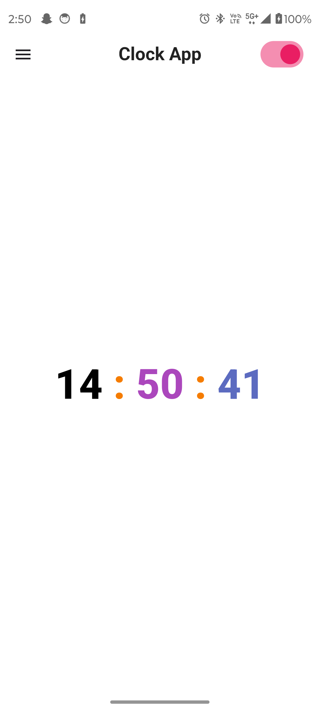
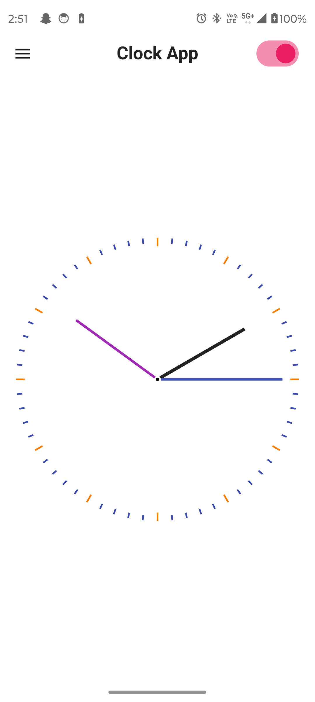

# Clock App ⏰

A Flutter-based Clock App with multiple clock styles and customization options! This app features a selection of clock styles, customizable backgrounds, and the ability to switch between analog and digital clock types.

---

## Features

### 1. Clock Styles Screen
- **Multiple Clock Types**: Access different clock styles (Strap, Analog, Digital) through a side drawer.
- **Background Customization**: Easily change the background color to match your mood or preference.
- **Smooth Transitions**: Seamless switching between different clock styles with a smooth user experience.

### 2. Minimalist Clock Screen
- **Dual Clock Display**: Shows an analog clock with digital time subtly placed behind it for a clean, minimalist look.
- **Location Selection**: Choose a state to display the current time for that specific location.
- **State Changing Option**: Quickly switch between different states for time zone-specific views.

---

## Screenshots

<table style="border-collapse: collapse; width: 100%;">
<tr>
<th colspan="4" style="text-align: center; border: 0;">Screenshots</th>
</tr>
<tr>
<td style="width: 250px; border: 0;">



</td>
<td style="width: 220px; border: 0;">



</td>
<td style="width: 220px; border: 0;">



</td>
<td style="width: 220px; border: 0;">



</td>

</tr>

<tr>
<td style="width: 250px; border: 0;">



</td>
<td style="width: 220px; border: 0;">



</td>
<td style="width: 220px; border: 0;">



</td>
<td style="width: 220px; border: 0;">



</td>

</tr>

</table>


---

## Getting Started

### Prerequisites
- **Flutter** installed on your system.
- Compatible Android or iOS emulator/device.

### Installation

1. **Clone the repository**:
   ```bash
   git clone https://github.com/jagritixjha/clock_app.git
